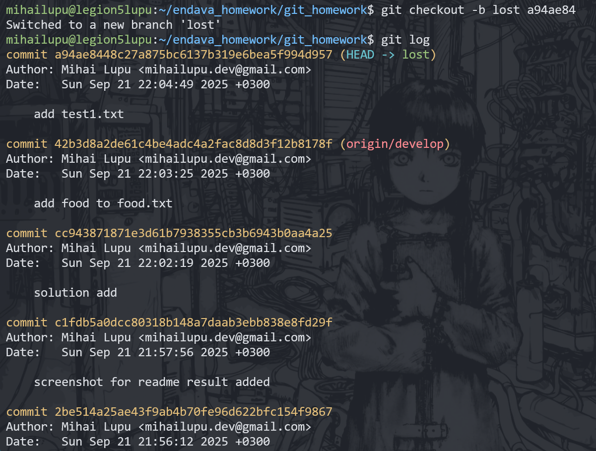
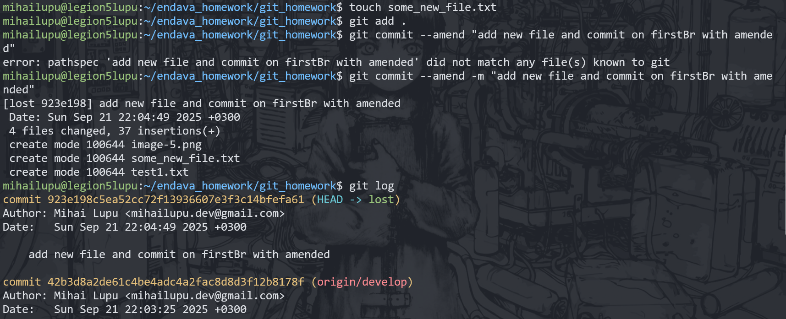

# Endava github homework.

## 1. Create a local repo and link it with remote repo.

(DONE)

## 2. Create a new txt file (with name file1.txt) on the main branch and then add some changes (do 2 commits).

## 3. Create a new branch from main with name develop:

- create a new txt file (file2.txt)
- change the name of the file1.txt and then modify the content of the file1.txt
- add all these changes to index area, then add a new content to file2.txt, do commit, run git log
- run command ls -l, check files content

## 4. Move to main branch:

- What happen? Why? How to solve this? (you must to have an issue)
  
- solve the issue and move to main branch
- run git log, what do you see?
- run command ls -l, check files content, what difference you see?

We see the commits and modifications from the main branch, and not the develop branch

## 5. Create a new file (.gitignore). Add to it the extension of the files what you want to ignore, then commit.

- move to develop
- Create a new file that you want to ignore, commit.
- What happen? why?

The .csv file was added because .gitignore with the file exceptions was in the main branch, not on the develop branch.

# PART II

## 1. on branch develop create a file food.txt, add some text to it

## 2. from branch develop create a new branch (with name - test)

- !!!!!!(don't make any changes in food.txt on this step)!!!!!!
- do 2 commits on it,
- then switch to develop,
- do one more commit
- merge branch test to develop
- git log

## 3. checkout on the first commit of the branch master

- create a new branch (firstBr) from this commit
- do 2 more commits on this branch
- rebase it with branch test
- git log
  
  Now the last commits from firstBr are on top of the branch test.

- reset hard last 2 commits
- git log
- what happen with commit history?
  
  The last 2 commits got removed and we moved back to where branch test ended

## 4. search the commits that have been reset

- create a new branch (lost) from one of them
- git log
  
- do some changes and then commit amend
- git log
- what happen with commit history?
  
  The new commit to which we moved has been replaced with the amend, from the latest "lost" standpoint.

## 5. checkout on the develop branch,

- add new content in food.txt file, then commit them,
- add some new content to the same file, (don't make a commit)
- git status
- now switch to test branch
- git status
- what you can see at this moment? why it happen? solve the problem!
  
  We could not move to test branch because we have uncommited changes left on branch develop.

## 6. switch to the branch firstBr

- create a new file (color.txt), do commit
- add content to this new file, (don't make a commit)
- switch to master
- what happen? why?
  
  We also could not move to main branch because of uncommited changes.
